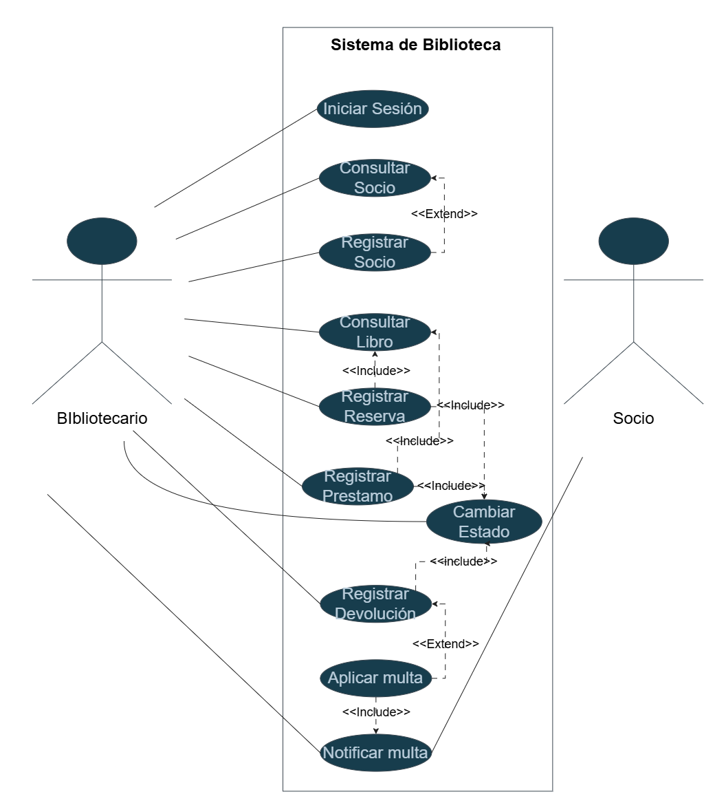
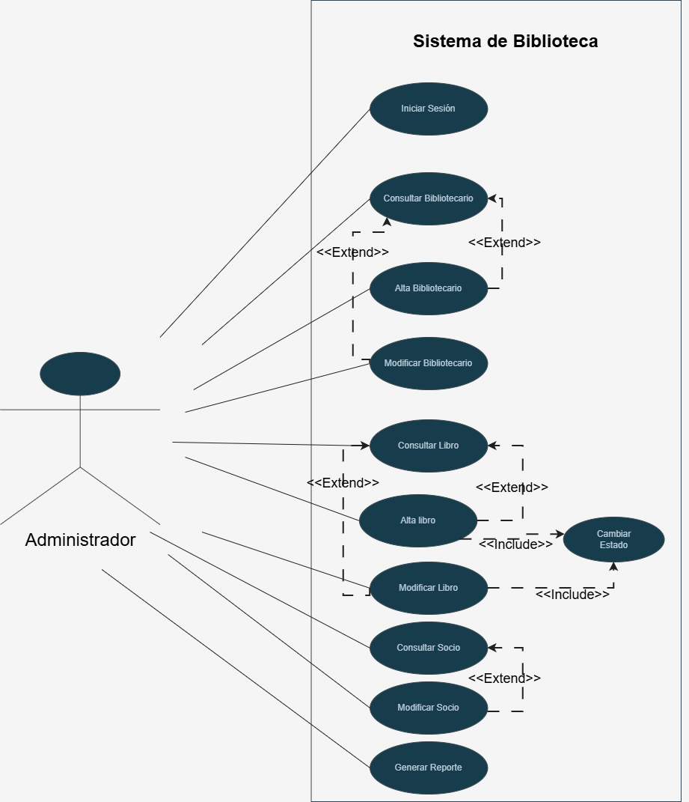

## 👥 Actores del Sistema

El diagrama de casos de uso representa las principales funcionalidades que el sistema de Biblioteca ofrece a los distintos actores que interactúan con él.

Su objetivo principal es mostrar:

* qué servicios brinda el sistema,
* quiénes los utilizan,
* y cómo se relacionan funcionalmente los distintos casos de uso.

El diagrama permite obtener una visión global del sistema antes de avanzar hacia modelos más detallados como:

* diagramas de clases,
* secuencia,
* o estados.

---

| Actor         | Descripción                                      |
| ------------- | ------------------------------------------------ |
| Bibliotecario | Registra socios, reservas, devoluciones y multas |
| Administrador | Gestiona los libros, personal, socios y reportes |

Cada actor interactúa únicamente con las funcionalidades relacionadas con sus responsabilidades dentro de la Biblioteca.

---

## 📚 Casos de Uso Bibliotecario

| Código | Caso de Uso          |
| ------ | -------------------- |
| CU-01  | Iniciar sesión       |
| CU-02  | Consultar Socio      |
| CU-03  | Registrar Socio      |
| CU-04  | Consultar Libro      |
| CU-05  | Registrar Reserva    |
| CU-06  | Registrar Préstamo   |
| CU-07  | Registrar Devolución |
| CU-08  | Cambiar Estado|
| CU-09  | Aplicar Multa        |

## 👩‍💼 Casos de Uso Administrador

| Código | Caso de Uso             |
| ------ | ----------------------- |
| CU-01  | Iniciar sesión          |
| CU-02  | Consultar Bibliotecario |
| CU-03  | Alta Bibliotecario      |
| CU-04  | Modificar Bibliotecario |
| CU-05  | Consultar Libro         |
| CU-06  | Alta Libro              |
| CU-07  | Modificar Libro         |
| CU-08  | Consultar Socio         |
| CU-09  | Modificar Socio         |
| CU-10  | Cambiar estado       |
| CU-11  | Generar Reporte         |

---

# 📚 Actor: Bibliotecario

# 📖 Explicación — Casos de Uso Bibliotecario

El Bibliotecario es el actor que interactúa con el sistema. Su función es garantizar el correcto funcionamiento del catálogo, los préstamos, las devoluciones y la gestión de socios.

---

# 📌 Relación <<include>>

La relación `<<include>>` representa funcionalidades obligatorias en el sistema.

Por ejemplo:

* al registrar un préstamo, el sistema debe verificar la disponibilidad del libro.
* tambien al registrar reserva,prestamo o devolucion,es obligatorio que cambie el estado del libro dependiendo lo que se realice.
* y para registrar una reserva, el sistema debe consultar la disponibilidad del libro.

Estas acciones siempre se ejecutan como parte del flujo principal.

---

# 📌 Relación <<extend>>

La relación `<<extend>>` representa escenarios alternativos u opcionales.

En este caso:

 Aplicar Multa.

Esta acción no siempre se ejecuta, depende de las condiciones específicas del sistema.

---

# 📌 Objetivo del modelo

El diagrama permite representar las responsabilidades del bibliotecario dentro del sistema y las relaciones existentes entre funcionalidades vinculadas en el sistema.

---

# 👩‍💼 Actor: Administrador

# 📖 Explicación — Casos de Uso Administrador

# 📌 Relación <<include>>

Las relaciones `<<include>>` representan funcionalidades obligatorias en el sistema.

Por ejemplo:

* Se usa para cambiar el estado de la disponiblidad del libro (obligatorio al dar de Alta Libro).

Estas funcionalidades siempre forman parte del caso principal.

---

# 📌 Relación <<extend>>

Las relaciones `<<extend>>` representan comportamientos opcionales o condicionales.

Por ejemplo:

* Alta Bibliotecario, Modificar Bibliotecario, Alta Libro, Modificar Libro y Modificar Socio durante sus respectivas consultas.

---

# 📌 Objetivo del modelo

Gestionar el bibliotecario, el socio y realizar reportes.
