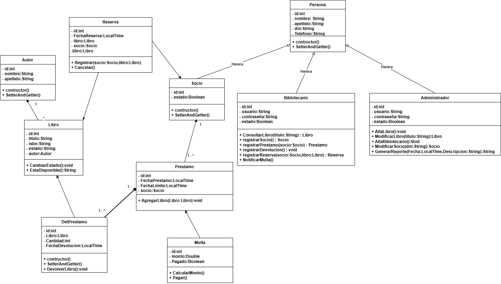

## 🧩 Modelo de Dominio

## 📖 Descripción

El modelo de dominio representa las principales entidades del sistema de biblioteca y las relaciones existentes entre ellas.

El sistema permite gestionar:

- libros,
- autores,
- socios,
- préstamos,
- reservas,
- multas,
- bibliotecarios.

---

# 📖 Explicación — Diagrama de Clases General

El diagrama de clases representa la estructura estática del sistema de biblioteca.

En él se identifican las principales entidades del dominio, sus atributos y las relaciones existentes entre ellas.

---

# 📌 Herencia

La clase `Persona` actúa como superclase generalizando atributos comunes como:

- nombre,
- apellido,
- teléfono.

De ella heredan:

- Socio
- Bibliotecario
- Administrador

La herencia permite reutilizar atributos y representar especializaciones del dominio.

---

# 📌 Composición

La relación entre `Prestamo` y `DetallePrestamo` se modela mediante composición.

Esto indica que:

un préstamo está compuesto por uno o varios detalles,
los detalles dependen completamente del préstamo,
y no pueden existir de forma independiente.

La multiplicidad:

1 ---- 1..*

indica que:

un préstamo contiene uno o varios detalles,
cada detalle pertenece a un único préstamo.

---

# 📌 Asociación

Las asociaciones representan relaciones estructurales entre entidades del dominio.

Por ejemplo:

un autor puede escribir varios libros,
un socio puede registrar múltiples préstamos,
un socio puede realizar reservas,
un libro puede participar en múltiples préstamos,
un préstamo puede generar una multa.

---

# 📌 Multiplicidades

Las multiplicidades permiten indicar cuántas instancias de una clase pueden relacionarse con otra.

Ejemplos:

un autor puede escribir muchos libros,
un socio puede realizar múltiples préstamos,
un libro puede participar en muchos préstamos,
un préstamo puede contener varios libros.

---

# 📖 Explicación — Relación Autor y Libro

Este diagrama representa la relación entre las entidades `Autor` y `Libro` dentro del sistema veterinario.

---

# 📌 Interpretación del dominio

En el sistema:

un autor puede haber escrito varios libros,
cada libro pertenece a un único autor.

Esta relación permite organizar el catálogo bibliográfico.

---

# 📌 Multiplicidad

1 -------- 0..*

indica que:

un autor puede escribir múltiples libros,
cada libro tiene un único autor.

---

# 📌 Responsabilidades

Autor

Representa al escritor de una obra.

Contiene:

id,
nombre.

Libro

Representa una obra disponible en la biblioteca.

Contiene:

título,
ISBN,
estado,
autor.

---

# 📌 Importancia del modelo

- Permite mantener organizado el catálogo bibliográfico y realizar búsquedas por autor.

---

# 📖 Explicación — Relación Socio y Préstamo

Este diagrama representa las relaciones principales involucradas en el proceso de préstamo de libros.

Participan las entidades:

Socio,
Prestamo,
DetallePrestamo,
Libro.

---

# 📌 Asociación Socio — Préstamo

La relación entre `Socio` y `Prestamo` se representa mediante una asociación.

La multiplicidad:

1 -------- 0..*

indica que:

un socio puede registrar múltiples préstamos,
cada préstamo pertenece a un único socio.

---

# 📌 Asociación Libro — DetallePrestamo

La relación entre `Libro` y `DetallePrestamo` se representa mediante una asociación.

Esto permite:

registrar qué libros fueron prestados,
controlar la devolución de cada ejemplar.

La multiplicidad:

1 -------- 0..*

indica que:

un libro puede aparecer en múltiples préstamos a lo largo del tiempo.

---

# 📖 Explicación — Relación Socio y Reserva

Este diagrama representa la relación entre las entidades Socio, Reserva y Libro dentro del sistema de biblioteca.

Participan las entidades:

Socio,
Reserva,
Libro.

# 📌 Asociación Socio — Reserva

La relación entre `Socio` y `Reserva` se representa mediante una asociación.

La multiplicidad:

1 -------- 0..*

indica que:

un socio puede realizar múltiples reservas,
cada reserva pertenece a un único socio.

Esta relación permite registrar las solicitudes de reserva realizadas por los usuarios de la biblioteca.

---

# 📌 Asociación Libro — Reserva

La entidad `Libro` también se relaciona con `Reserva`.

La multiplicidad:

1 -------- *

indica que:

un libro puede ser reservado múltiples veces a lo largo del tiempo,
cada reserva corresponde a un único libro.

---

# 📌 Responsabilidades de las clases

## Socio

Representa al usuario registrado en la biblioteca.

Contiene:

- datos personales,
- estado de membresía.

---

## Prestamo

Representa la operación de préstamo.

Incluye:

- fecha de préstamo,
- fecha límite.

---

## DetallePrestamo

Representa cada libro incluido dentro de un préstamo.

Registra:

- libro,
- fecha de devolución.

---

## Libro

Representa una obra disponible en la biblioteca.

Contiene:

- título,
- ISBN,
- estado.

---

# Importancia del modelo

Este tipo de modelado permite:

- controlar préstamos activos,
- registrar devoluciones,
- mantener historial de préstamos,
- conocer la disponibilidad de libros.

---

# 📖 Explicación — Relación Préstamo — Multa

La relación entre Prestamo y Multa se representa mediante una asociación.

La multiplicidad:

1 -------- 0..1

indica que:

un préstamo puede generar una multa,
pero no todos los préstamos generan sanciones.

---

# 📌 Responsabilidades de las clases

## Prestamo

Representa una operación de préstamo de libros.

Permite:

- controlar fechas,
- registrar retrasos,
- gestionar devoluciones.

## Multa

Representa una sanción económica aplicada a un socio.

Contiene:

- monto,
- estado de pago.

---

# Importancia del modelo

Permite:

- controlar retrasos,
- aplicar sanciones,
- mejorar la recuperación de ejemplares.

---

# 📌 Objetivo del modelo

El diagrama de clases permite:

- comprender la estructura del sistema,
- identificar responsabilidades,
- modelar relaciones,
- servir de base para el diseño orientado a objetos,
- y facilitar la implementación del sistema de biblioteca.

---