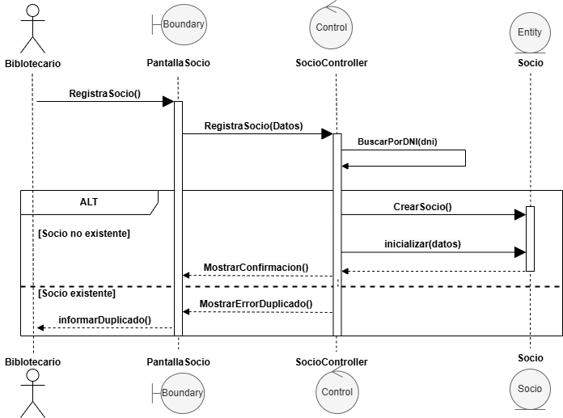

# 👤 Registrar Cliente

---

## 📖 Explicacion de la secuencia

El proceso comienza cuando el **Bibliotecario** solicita registrar un nuevo socio en el sistema de la biblioteca.

1.  Desde la interfaz `PantallaSocio`, el bibliotecario inicia la acción `RegistraSocio()`.
2.  La pantalla envía la solicitud con los datos recolectados al objeto de control `SocioController`, encargado de coordinar la lógica de negocio.
3.  El controlador ejecuta un **Metodo** llamado `BuscarPorDNI(dni)` para verificar si el socio ya se encuentra en el sistema.

A continuación, el flujo se divide mediante un frame `alt` (Alternativa), representando los dos escenarios posibles:

---
## ✅ Escenario 1 — Socio no existente

Si el DNI consultado no esta registrado:
- El controlador ejecuta la instrucción de creación para una nueva entidad `Socio`.
- Se invoca el método `inicializar(datos)` sobre la entidad para asignar la información del nuevo miembro.
- Una vez creada la entidad, el controlador ordena a la interfaz ejecutar `MostrarConfirmacion()`, notificando el éxito de la operación al bibliotecario.
---

## ❌ Escenario 2 — Socio existente

Si durante la búsqueda inicial se detecta que el DNI ya esta registrado:
- El controlador cancela cualquier intento de creación de entidad para no realizar duplicados .
- Se envía la instrucción `MostrarErrorDuplicado()` a la interfaz.
- Finalmente, la pantalla ejecuta `informarDuplicado()`, mostrando un mensaje de alerta al bibliotecario para evitar el registro repetido.
---

# 📌 Aspectos importantes del diagrama

- El diagrama sigue el patrón MVC:
  - `Boundary`(`PantallaSocio`) → interacción con el usuario.
  - `Control`(`SocioController`) → coordinación del caso de uso.
  - `Entity` (`Socio`)→ Representa el objeto de dominio y resguarda la información del socio.

- `SocioController` coordina el flujo principal del proceso.

- La entidad `Socio` encapsula su propia lógica de validación mediante autodelegación.

- El frame `alt` modela comportamientos alternativos:
  - Socio existente,
  - Socio inexistente,
  - datos válidos,
  - datos inválidos.

- La instrucción `create` representa la creación dinámica de un objeto del dominio.

- El diagrama mantiene un nivel de análisis UML, evitando detalles de persistencia o acceso a base de datos.

